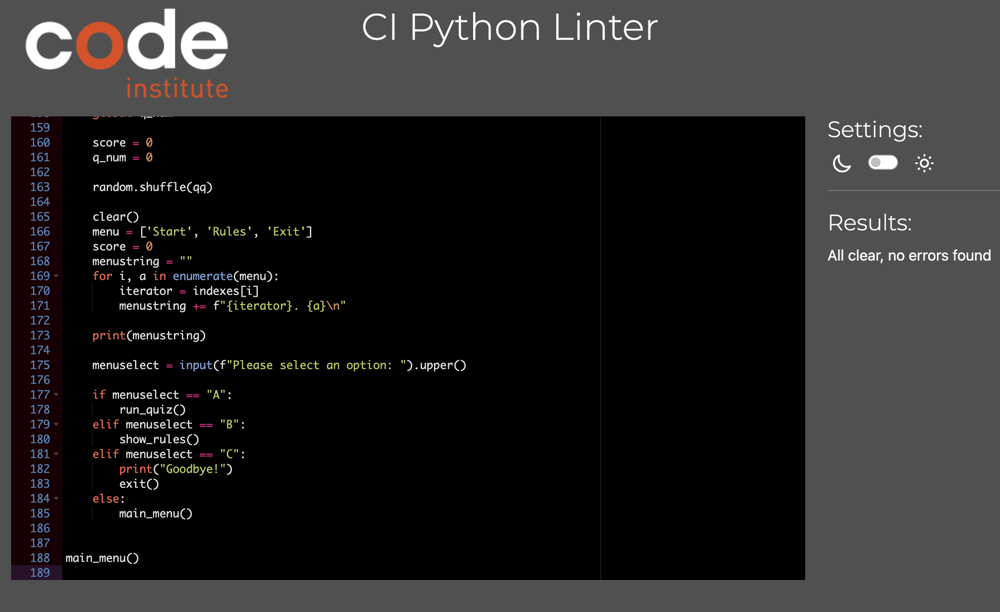

# Harry Potter Quiz

link to deployed site: https://harry-potter-quiz-287fba48143f.herokuapp.com/

This is my PP3 Python project for my Diploma in Full Stack software development at Code Institute.

This is a quiz based application created with Python.

This is a multiple choice quiz. with a main menu, Rules option, and Exit option randomised questions and answers to keep repeat users playing.

## Target Audience.

Anyone that would like to test the knowledge on the Harry Potter films

## User Stories.

A site for someone to test there general knowledge in Harry Potter.

A representation of how the basis of Python works , easy to visualise the code for new coders,variables to functions, to different scopes.

## Design.

### General Structure.
This is back End code displayed in a mock terminal provided by Heroku 

### Wire Frame.

as this is back end development a wire frame would not suite this application 

## Features.

Randomising of questions and answers to make the quiz less repetitive 
the score is tallied up through a function that is displayed at the end of the quiz.

### Testing.

  - Test was done before deployment to see if everything in the terminal was acting correctly.
  - While hosting on Heroku, multiple OS were used to test the functionality of the quiz. such as macOS and Windows 
  - all imports are working. 

  
  
  ### Bugs.

  - I came across no major bugs while testing. 
  - just a spacing problem that was caused by the incorrect placement of '\n'
  - and a problem with the quiz restarting at question 11 instead of question 1 with a quiz restart
  
  ### Validator Testing.

  
 ### Technologies and Languages used.
    
- Github - used for repositories and deployment of website through github pages.
- Codeanywhere - IDE used for writing code.
- HTML - Language used for structure of website.
- CSS - Language used for styling the structure of the website.
- JavaScript - Language used for the script, used to make the site less static with more function.
- Font Awesome - Used for custom fonts within the website such as website links.
- Google Fonts - used for typography throughout the website.
- lightHouse - used to test site peformance.
- Wave - used to test visability and accessability.
- WC3 - used for validators of markdown symantics and CSS through jigsaw

### Unfixed Bugs. 

- No unfixed bugs.

### Deployment.

  Harry Potter Quiz is deployed on Heroku.
- Steps to deploy
- Commit and push to GitHub
- Go to the Heroku Dashboard
- Click "Create new app"
- Name app and select location
- Add Config Vars for Creds and Port in Settings tab
- Add the buildbacks to Python and NodeJS in that order
- Select appropriate deployment method, GitHub
- Connect to Github and link to repository
- Enable automatic deployment and/or deploy manually
- Click on Deploy
- Live link to Harry Potter Quiz can be found here: https://harry-potter-quiz-287fba48143f.herokuapp.com/

### Credits.

- Python understanding and implimentation for randomising the questions and answers came from a family friend, Luke Janse Van Rensburg.

### Media.

- No Media 
